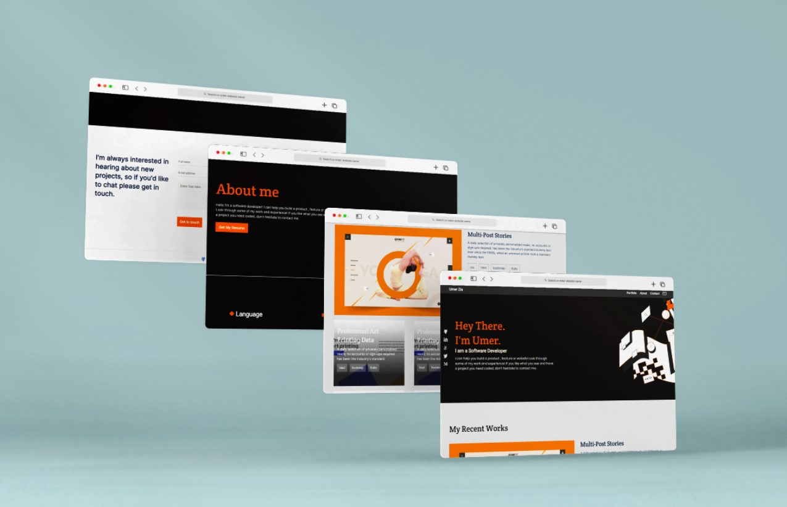

# Portfolio

### This project is a task by Microverse.

#### Milestone completed: 

> Designed mobile first version.

> Added Navigation and Hero section.

> Install Linters.

> Add Work section.

> Add About Me Section.

> Apply grid layout.

> Add Contact Us section.

> Add form validation.

> Add live link.

> Add animation.

> Add media query for screen equal or wider than 768px.

> Add aria roles to non semantic tags.

> Add dynamic modal in work section.

> Created whole card section dynamically.

> Add email validation.

> Save data and render data from local storage

## Language Used

- HTML
- CSS
- JS

## Live Demo
> [Click here for live preview](https://umerzia.github.io/Portfolio/)

## Website Preview

## Getting Started

> In order to use the project files, Kindly follow these steps:

### Steps

- To clone the project select the desired directory in cmd and run: git clone https://github.com/UmerZia/Portfolio.git
- Install node.js, Install NPM linters for HTML/CSS (https://github.com/microverseinc/linters-config/tree/master/html-css).
- For Stylint check run: npx stylelint "**/*.{css,scss}"
- For Webhint check run: npx hint .

### Prerequisites

- Have basic level knowledge about HTML/CSS
- Have basic level knowledge about linters
- Have basic level knowledge about the working of website

## Author

#### Umer Zia

> [GitHub](https://github.com/UmerZia)

> [Twitter](https://twitter.com/InfinusDesign)

> [LinkedIn](https://linkedin.com/in/umer-zia-30906a183/)

## 🤝 Contributing

Contributions, issues, and feature requests are welcome!

Feel free to check the [issues page](../../issues/).

## Show your support

Give a ⭐ if you like this project!

## Acknowledgments

> Inspired by provided [figma template](https://www.figma.com/file/l7SqJ3ZfkAKih9sFxvWSR4/Microverse-Student-Project-1?node-id=34%3A1278) by Microverse

> Website favicon is designed by [Wikimedia Commons](https://commons.wikimedia.org/wiki/File:Utah_Utes_-_U_logo.svg)

> #### Contributions: [Kolapo Precious Akinrinlola](https://github.com/LIBERCOSOFT) , [Emmanuel Balikuddembe](https://github.com/Balikuddembe) , [Rashid Menhas](https://github.com/RashidMenhas) , [shinyenyi](https://github.com/shinyenyi/myPortfolio)

## 📝 License

This project is [MIT](./MIT.md) licensed.